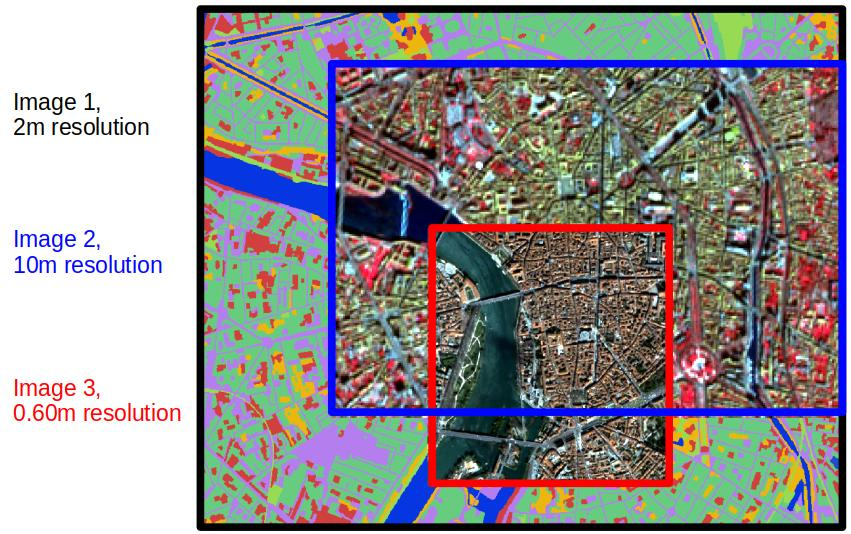
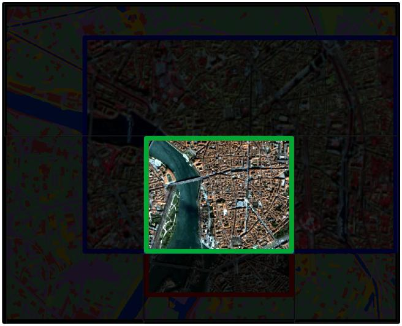
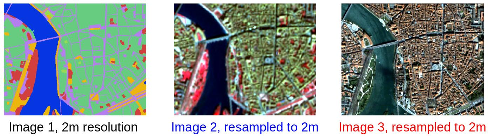

# pyotb: a pythonic extension of OTB

## Installation
Requirements:
- python >= 3.6
- OrfeoToolBox python API installed

First step:
```bash
git clone https://gitlab.orfeo-toolbox.org/nicolasnn/pyotb.git
```
Then for installing the library:
```bash
cd pyotb
python setup.py install
```

In case of permission denied error, try `python setup.py install --user` instead.

## Quickstart: running an OTB app as a oneliner
pyotb has been written so that it is more convenient to run an application in Python.

For example, let's consider one wants to undersample a raster. Using OTB, the code would be like :
```python
import otbApplication

input_path = 'my_image.tif'
resampled = otbApplication.Registry.CreateApplication('RigidTransformResample')
resampled.SetParameterString('in', input_path)
resampled.SetParameterString('interpolator', 'linear')
resampled.SetParameterFloat('transform.type.id.scalex', 0.5)
resampled.SetParameterFloat('transform.type.id.scaley', 0.5)
resampled.SetParameterString('out', 'output.tif')
resampled.ExecuteAndWriteOutput()
```

Instead, using pyotb, you can pass the parameters as a dictionary : 
```python
import pyotb

input_path = 'my_image.tif'
pyotb.RigidTransformResample({'in': input_path, 'interpolator': 'linear', 'out': 'output.tif',
                              'transform.type.id.scaley': 0.5, 'transform.type.id.scalex': 0.5})
```

## Using Python keyword arguments
It is also possible to use the Python keyword arguments notation for passing the parameters:
```python
pyotb.SuperImpose(inr='reference_image.tif', inm='image.tif', out='output.tif')
```
is equivalent to:
```python
pyotb.SuperImpose({'inr': 'reference_image.tif', 'inm': 'image.tif', 'out': 'output.tif'})
```

Limitations : for this notation, python doesn't accept the parameter `in` or any parameter that contains a `.`. E.g., it is not possible to use `pyotb.RigidTransformResample(in=input_path...)` 


## In-memory connections
The big asset of pyotb is the ease of in-memory connections between apps.

Let's start from our previous example. Consider the case where one wants to apply optical calibration and binary morphological dilatation 
following the undersampling. Using OTB : 

```python
import otbApplication

resampled = otbApplication.Registry.CreateApplication('RigidTransformResample')
resampled.SetParameterString('in', 'my_image.tif')
resampled.SetParameterString('interpolator', 'linear')
resampled.SetParameterFloat('transform.type.id.scalex', 0.5)
resampled.SetParameterFloat('transform.type.id.scaley', 0.5)
resampled.Execute()

calibrated = otbApplication.Registry.CreateApplication('OpticalCalibration')
calibrated.ConnectImage('in', resampled, 'out')
calibrated.SetParameterString('level', 'toa')
calibrated.Execute()

dilated = otbApplication.Registry.CreateApplication('BinaryMorphologicalOperation')
dilated.ConnectImage('in', calibrated, 'out')
dilated.SetParameterString("filter", 'dilatation')
dilated.SetParameterString("structype", 'ball')
dilated.SetParameterInt("xradius", 3)
dilated.SetParameterInt("yradius", 3)
dilated.SetParameterString('out', 'output.tif')
dilated.ExecuteAndWriteOutput()
```

Using pyotb, you can pass the output of an app as input of another app : 
```python
import pyotb

resampled = pyotb.RigidTransformResample({'in': 'my_image.tif', 'interpolator': 'linear', 
                                          'transform.type.id.scaley': 0.5, 'transform.type.id.scalex': 0.5})

calibrated = pyotb.OpticalCalibration({'in': resampled, 'level': 'toa') 

pyotb.BinaryMorphologicalOperation({'in': calibrated, 'out': 'output.tif', 'filter': 'dilatation', 
                                    'structype': 'ball', 'xradius': 3, 'yradius': 3})
# equivalent to
# pyotb.BinaryMorphologicalOperation(resampled, out='output.tif', filter='dilatation', structype='ball',
#                                    xradius=3, yradius=3)
```

## Writing the result of an app
Any pyotb object can be written to disk using the `write` method, e.g.

```python
import pyotb

resampled = pyotb.RigidTransformResample({'in': 'my_image.tif', 'interpolator': 'linear',
                                          'transform.type.id.scaley': 0.5, 'transform.type.id.scalex': 0.5})

resampled.write('output.tif', pixel_type='uint16')
```


## Arithmetic operations
Every pyotb object supports arithmetic operations, such as addition, subtraction, comparison...
Consider an example where we want to perform the arithmetic operation `image1 * image2 - 2*image3`

Using OTB, the following code works for 3-bands images :
```python
import otbApplication

bmx = otbApplication.Registry.CreateApplication('BandMathX')
bmx.SetParameterStringList('il', ['image1.tif', 'image2.tif', 'image3.tif'])  # all images are 3-bands
exp = 'im1b1*im2b1 - 2*im3b1; im1b2*im2b2 - 2*im3b2; im1b3*im2b3 - 2*im3b3'
bmx.SetParameterString('exp', exp)
bmx.SetParameterString('out', 'output.tif')
bmx.SetParameterOutputImagePixelType('out', otbApplication.ImagePixelType_uint8)
bmx.ExecuteAndWriteOutput()
```

With pyotb, the following works with images of any number of bands : 
```python
import pyotb

# transforming filepaths to pyotb objects
input1, input2, input3 = pyotb.Input('image1.tif'), pyotb.Input('image2.tif') , pyotb.Input('image3.tif')

res = input1 * input2 - 2 * input2
res.write('output.tif', pixel_type='uint8')
```

## Slicing
pyotb objects support slicing in a Python fashion :

```python
import pyotb

# transforming filepath to pyotb object
input = pyotb.Input('my_image.tif')

input[:, :, :3]  # selecting first 3 bands
input[:, :, [0, 1, 4]]  # selecting bands 1, 2 & 5
input[:1000, :1000]  # selecting 1000x1000 subset
```

Using OTB only, this would be more laborious :
```python
import otbApplication

# selecting first 3 bands
extracted = otbApplication.Registry.CreateApplication('ExtractROI')
extracted.SetParameterString('in', 'my_image.tif')
extracted.SetParameterStringList('cl', ['Channel1', 'Channel2', 'Channel3'])
extracted.Execute()

# selecting 1000x1000 subset
extracted = otbApplication.Registry.CreateApplication('ExtractROI')
extracted.SetParameterString('in', 'my_image.tif')
extracted.SetParameterString('mode', 'extent')
extracted.SetParameterString('mode.extent.unit', 'pxl')
extracted.SetParameterFloat('mode.extent.ulx', 0)
extracted.SetParameterFloat('mode.extent.uly', 0)
extracted.SetParameterFloat('mode.extent.lrx', 999)
extracted.SetParameterFloat('mode.extent.lry', 999)
extracted.Execute()
```

## pyotb.where function
The `pyotb.where` function has been written to mimic the behavior of `numpy.where`.
It is the equivalent of the muparser syntax `condition ? x : y` that can be used in OTB's BandMath.

```python
import pyotb

# transforming filepaths to pyotb objects
labels, image1, image2 = pyotb.Input('labels.tif'), pyotb.Input('image1.tif') , pyotb.Input('image2.tif')

# If labels = 1, returns image1. Else, returns image2 
res = pyotb.where(labels == 1, image1, image2)  # this would also work: pyotb.where(labels == 1, 'image1.tif', 'image2.tif') 

# A more complex example
# If labels = 1, returns image1. If labels = 2, returns image2. If labels = 3, returns 3. Else 0
res = pyotb.where(labels == 1, image1,
                  pyotb.where(labels == 2, image2,
                              pyotb.where(labels == 3, 3, 0)))

```


## Interaction with Numpy

pyotb objects can be transparently used in numpy functions.

```python
import pyotb
import numpy as np

input = pyotb.Input('image.tif')  # this is a pyotb object

# Creating a numpy array of noise
white_noise = np.random.normal(0, 50, size=input.shape)  # this is a numpy object

# Adding the noise to the image
noisy_image = np.add(input, white_noise)  # magic: this is a pyotb object that has the same georeference as input
noisy_image.write('image_plus_noise.tif')
```
Limitations : 
- The whole image is loaded into memory
- The georeference can not be modified. Thus, numpy operations can not change the image or pixel size
  (e.g. it is not possible to use `np.pad`)


## Interaction with Tensorflow

We saw that numpy operations had some limitations. To bypass those limitations, it is possible to use some Tensorflow operations on pyotb objects.


You need a working installation of OTBTF >=3.0 for this and then the code is like this:

```python
import pyotb

def scalar_product(x1, x2):
    """This is a function composed of tensorflow operations."""
    import tensorflow as tf
    return tf.reduce_sum(tf.multiply(x1, x2), axis=-1)

# Compute the scalar product
res = pyotb.run_tf_function(scalar_product)('image1.tif', 'image2.tif')  # magic: this is a pyotb object
res.write('scalar_product.tif')
```

For some easy syntax, one can use `pyotb.run_tf_function` as a function decorator, such as:
```python
import pyotb

@pyotb.run_tf_function  # The decorator enables the use of pyotb objects as inputs/output of the function
def scalar_product(x1, x2):
    import tensorflow as tf
    return tf.reduce_sum(tf.multiply(x1, x2), axis=-1)

res = scalar_product('image1.tif', 'image2.tif')  # magic: this is a pyotb object
```

Advantages :
- The process supports streaming, hence the whole image is **not** loaded into memory
- Can be integrated in OTB pipelines

Limitations :
- It is not possible to use the tensorflow python API inside a script where OTBTF is used because of compilation issues between Tensorflow and OTBTF
- It is currently not possible to chain several `@pyotb.run_tf_function` functions


## Miscellaneous: Work with images with differents footprints / resolutions
OrfeoToolBox provides a handy `Superimpose` application that enables the projection of an image into the geometry of another one.

In pyotb, a function has been created to handle more than 2 images.

Let's consider the case where we have 3 images with different resolutions and different footprints :



```python
import pyotb

# transforming filepaths to pyotb objects
s2_image, vhr_image, labels = pyotb.Input('image_10m.tif'), pyotb.Input('image_60cm.tif'), pyotb.Input('land_cover_2m.tif')

print(s2_image.shape)  # (286, 195, 4)
print(vhr_image.shape)  # (2048, 2048, 3)
print(labels.shape)  # (1528, 1360, 1)
```
Our goal is to obtain all images at the same footprint, same resolution and same shape. 
Let's consider we want the intersection of all footprints and the same resolution as `labels` image.



Here is the final result :


The piece of code to achieve this : 
```python
s2_image, vhr_image, labels = pyotb.define_processing_area(s2_image, vhr_image, labels, window_rule='intersection',
                                                           pixel_size_rule='same_as_input', 
                                                           reference_pixel_size_input=labels, interpolator='bco')

print(s2_image.shape)  # (657, 520, 4)
print(vhr_image.shape)  # (657, 520, 3)
print(labels.shape)  # (657, 520, 1)
# Then we can do whichever computations with s2_image, vhr_image, labels
```


