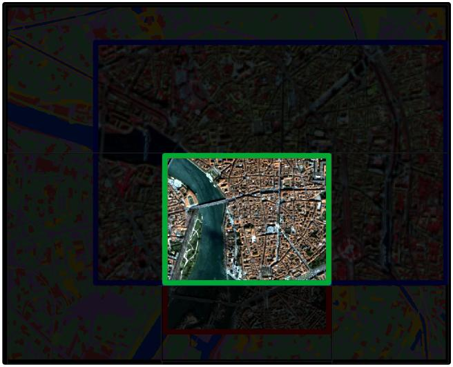
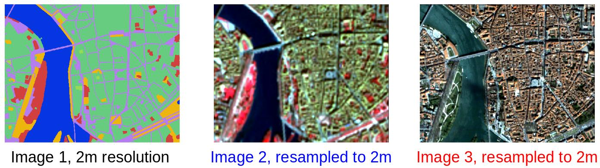

## Miscellaneous: Work with images with different footprints / resolutions
OrfeoToolBox provides a handy `Superimpose` application that enables the projection of an image into the geometry of another one.

In pyotb, a function has been created to handle more than 2 images.

Let's consider the case where we have 3 images with different resolutions and different footprints :


```python
import pyotb

# transforming filepaths to pyotb objects
s2_image, vhr_image, labels = pyotb.Input('image_10m.tif'), pyotb.Input('image_60cm.tif'), pyotb.Input('land_cover_2m.tif')

print(s2_image.shape)  # (286, 195, 4)
print(vhr_image.shape)  # (2048, 2048, 3)
print(labels.shape)  # (1528, 1360, 1)
```
Our goal is to obtain all images at the same footprint, same resolution and same shape. 
Let's consider we want the intersection of all footprints and the same resolution as `labels` image.



Here is the final result :


The piece of code to achieve this : 
```python
s2_image, vhr_image, labels = pyotb.define_processing_area(s2_image, vhr_image, labels, window_rule='intersection',
                                                           pixel_size_rule='same_as_input', 
                                                           reference_pixel_size_input=labels, interpolator='bco')

print(s2_image.shape)  # (657, 520, 4)
print(vhr_image.shape)  # (657, 520, 3)
print(labels.shape)  # (657, 520, 1)
# Then we can do whichever computations with s2_image, vhr_image, labels
```
